# HTTP

## 协议简介

> 超文本传输协议（HyperText Transfer Protocol）是一种用于分布式、协作式和超媒体信息系统的应用层协议。HTTP是万维网的数据通信的基础


## 响应步骤

### 1.客户端连接到Web服务器

一个HTTP客户端，通常是浏览器，与Web服务器的HTTP端口（默认为80）建立一个**TCP套接字**连接

例如：http://www.baidu.com

### 2.发送HTTP请求

通过TCP套接字，客户端向Web服务器发送一个文本的请求报文，一个请求报文由：

**请求行**

**请求头部**

**空行**

**请求数据**

四部分组成

### 3.服务器接受请求并返回HTTP响应

Web服务器响应请求，定位请求资源。服务器将资源副本写道TCP套接字，由客户端读取，一个响应由：

**状态行**

**响应头部**

**空行**

**响应数据**

四部分组成。

### 4.释放TCP连接

在HTTP/1.0中默认使用短连接。也就是说客户端和服务器**每进行一次HTTP操作，就建立一次连接**，任务结束就中断连接，当客户端浏览器访问的是某个HTML或其它类型的Web页中包含有其他类型的Web资源（如CSS，JS，图像文件），每遇到这样的一个Web资源，	浏览器都会建立一个新的HTTP会话。

而从HTTP/1.1起，默认使用长连接，用以保持连接特性。使用长连接的HTTP协议，会再响应头部加入这行代码：

```
Connection:keep-alive
```

在使用长连接的情况下，当一个网页打开完成后，客户端和服务器之间用于传输HTTP数据的TCP连接不会关闭，客户端再次访问这个服务器时，会继续使用这一条已经建立的连接，Keep-Alive不会保持永久连接，它有一个保持时间，可以在不同的服务器软件（如Apache）中设定这个时间。实现长连接需要客户端和服务端都支持长连接。

HTTP协议的长连接和短连接，实质上是TCP协议的长连接和短连接。

### 5.客户端浏览器解析HTML内容

客户端浏览器首先解析状态行，查看表明是否成功的状态码。然后解析每一个响应头，响应头告知以下若干字节的HTML文档和文档的字符集，客户端浏览器读取响应数据的HTML，根据HTML的语法对其进行格式化，并在浏览器窗口显示。

举个例子：

> 在地址栏中输入URL，按下回车
>
> 1.浏览器向DNS服务器请求解析该URL中的域名所对应的IP地址
>
> 2.解析出IP地址后，根据该IP地址的默认端口80，和服务器建立HTTP连接
>
> 3.浏览器发出读取文件（URL中域名后面部分对应的文件）的HTTP请求，该请求报文作为TCP三次握手的第三个报文数据发给服务器
>
> 4.服务器对浏览器的请求做出响应，并把对应的HTML文本发送给浏览器
>
> 5.浏览器格式化HTML，并显示内容


**无状态保存**

HTTP是一种不保存状态，即无状态（stateless）协议，HTTP协议本身不对响应和请求之间的通信状态进行保存。也就是说在HTTP这个级别，协议对于发送过的请求或响应都不做持久化处理。

## 请求方法

HTTP/1.1协议中共定义了八种方法（也叫”动作“）来以不同方式操作指定的资源。

### GET

向指定资源发出”显示“请求，使用GET方法应该只用在读取数据，而不应当被用于产生”副作用“的操作中，例如在Web Application中。 其中一个原因是GET可能会被网络蜘蛛等随意访问

### HEAD

与GET方法一样，都是向服务器发出指定资源的请求，只不过服务器将不传回资源的本文部分。它的好处在于，使用这个方法可以在不必传输全部内容的情况下，就可以获取其中”关于该资源的信息“（称为元信息或元数据）

### POST

向指定资源提交数据，请求服务器处理（例如提交表单或者上传文件）。数据被包含在请求本文中，这个请求可能会创建新的资源或者修改现有资源，或二者都有

### PUT

向指定资源位置上传最新内容

### DELETE

请求服务器删除Request-URI所标识的资源

### TRACE

回显服务器收到的请求，主要用于测试或诊断

### OPTIONS

可以使服务器返回该资所支持的所有HTTP请求方法，用'*'来代替资源名称，向Web服务器发送OPTIONS请求，可以**测试服务器功能是否正常运作**

### CONNECT


## 两种开发模型

### C/S(Client/Server)

服务器通常采用高性能的PC、工作站或小型机，客户端需要安装专用的客户端软件，如QQ、微信

### B/S(Browser/Server)

客户机上只需安装一个浏览器，是建立在广域网的基础上的。

**各自的优缺点：**

啊吧啊吧

## Web服务器的分类

Web服务器是运行及发布Web应用的容器，只有将开发的Web项目放置到该容器中，才能使网络中的所有用户通过浏览器进行访问。开发Java Web应用所采用的服务器主要是与JSP/Servlet兼容的Web服务器，**比较常用的有Tomcat、Resin、jBoss、WebSphere、WebLogic**等

### Tomcat服务器

小型，轻量级的支持JSP和Servlet技术的Web服务器，初学首选

其它服务器自查

## Tomcat

### 下载安装

自查

### tomcat的目录

#### 

### IDEA配置tomcat 

easy

# Servlet

## 什么是Servlet

> 全称Java Servlet。是用Java编写的服务器端程序，其功能主要在于能交互式的浏览和修改数据，生成动态web内容。狭义的Servlet是指Java语言实现的一个接口，广义的Servlet 是指任何实现了这个Servlet接口的类，一般情况下，人们理解为后者

Servlet运行于支持Java的应用服务器中。从实现上讲，Servlet可以响应任何类型的请求，但绝大多数情况下Servlet只用来扩展基于HTTP协议的Web服务器。

### 工作模式

1. 客户端发送请求到服务器
2. 服务器启动并调用Servlet，Servlet根据客户端请求生成相应内容将其传给服务器
3. 服务器将响应返回客户端

## Servlet API

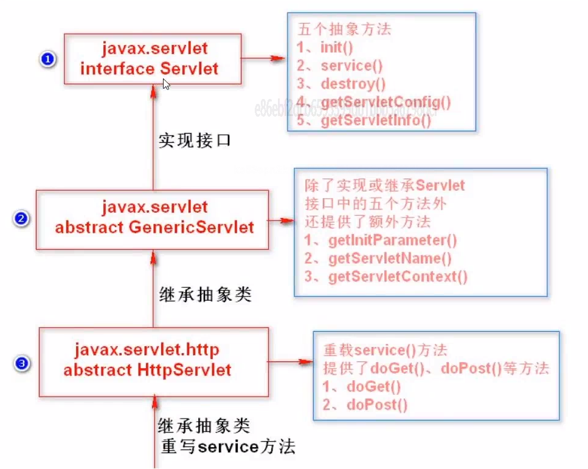

### 第一个Servlet


## Servlet工作原理

​	Servlet接口定义了Servlet和servlet容器之间的契约，这个契约是：**Servlet容器将Servlet类载入内存，并产生Servlet实例和调用它的具体方法，但是要注意的是，在一个应用程序中，每种Servlet只能有一个实例**

​	用户请求致使Servlet容器调用Servlet的Service()方法，**并传入一个ServletRequeset对象和一个ServletResponse对象。ServletRequest对象和ServletResponse对象都是由Servlet容器（例如Tomcat）封装好的，并不需要程序员实现**

​	ServletRequest中封装了当前的Http请求,因此开发人员不必解析和操作原始的Http数据，ServletResponse表示当前用户的Http响应，程序员只需直接操作ServletResponse就能轻松将Http响应返回给用户

​	对于每一个应用程序，**Servlet容器还会创建一个ServletContext对象，这个对象封装了上下文（应用程序）的环境详情，每个应用程序只有一个ServletContext。每个Servlet对象也都有一个封装的Servlet配置的ServletConfig对象。**

## Servlet的生命周期

​	当客户端发送第一个请求后，由容器（web服务器tomcat）解析请求，根据请求找到对应的servlet，判断该类的对象是否存在，不存在则创建servlet实例，调取`init()`方法，进行初始化操作，初始化完成后调用`servlet()`方法，由`service()`判断客户端的请求方式，如果是get，则执行`doGet()`，如果是post则执行`doPost()`，处理方法完成后，作出响应的结果发送回客户端，单词请求处理完毕。

​	当用户发送第二个请求时，会判断对象是否存在，但是不在执行`init()`，而是直接调用`service()`，调取doGet()/doPost()方法。

​	当服务器关闭时调取destroy()方法进行销毁

​	四个过程：

	1. 实例化 -先创建servlet实例
	1. 初始化 -`init()`
	1. 处理请求 -`service()`
	1. 服务终止 -`destroy()`


## 请求

> HttpServletRequest表示Http环境中的Servlet请求，它扩展于javax.servlet.ServletRequest(接口)

常用方法：

1. `String getParameters(Stirng name)`	根据表单组件名称获取提交数据，返回值是String

​	注：服务器在接受数据时使用字符串统一接收

2. `String[] getParameterValues(String name)`	根据表单组件对应多个值时的请求数据
3. `void setCharacterEncoding(String charset)`   指定每个请求的编码（针对Post请求才有作用）
4. `RequestDispatcher(String path)  getRequestDispatcher(String path)` -跳转页面

​				返回一个RequestDispatcher对象，该对象的forward()方法用于转发请求

​		示例：

```java
request.getRequestDispatcher("../success.jsp").forward(request.response)
```

5. 存值 `request.setAttribute("key",value)`;

6. 取值 `request.getAttribute("key")`;//取值后需要向下转型

   示例：`String a1 = (String)request.getAttribute("uname");`

   

**补充1：客户端如何发送数据给服务器**

1. 通过表单get/post提交
2. 通过a标签发送数据（get提交）

```html
<a href="请求名?key=value&key=value&key=value...">
example:
<a href="/login?username=JaysonTatum&password=000000">
```

这里的key值表示表单中的控件名，value值=表单中控件的value属性值

3. 通过地址栏直接拼接-get请求

4. js提交数据-get请求

   `location.href="目标请求?key=value&key=value"`

​	注意：方式2，3都属于get提交方式，表单提交可以使用get、post提交方式


**补充2：处理请求乱码**

1. `setCharacterEncoding("utf-8");`//post提交时管用

2. `String = new String(变量名.getBytes("ISO-8859-1"),"UTF-8")；`//针对get提交时的中文乱码

3. 修改tomcat配置文件 //用于get提交

   在tomcat目录结构\conf\server.xml中设定字符集


**补充3：get和post的区别**

1. GET请求，请求的数据会附着在URL之后，以？分割URL和传输数据，多个参数由&连接，URL的编码格式采用的是ASCII编码，而不是unicode，即所有的非ASCII字符都要编码之后再传输

​			POST请求，POST请求会把请求的数据放置在HTTP请求包的包体中，上面的item=bandsaw就是实际的传输数据。

​			因此，GET请求的数据会暴露在地址栏中，而POST不会

2. 传输数据的大小

​			在HTTP规范中，没有对URL的长度和传输的数据大小进行限制。但是在实际开发中，对于GET，特定的浏览器和服务器对URL有长度限制。因此，在使用GET请求时，传输数据会受到URL长度的限制。

​			对于POST，并不是URL传值，理论上不受限制，但实际上各个服务器会规定对POST请求传输数据的的限制。

3. 安全性

​			POST安全性更高，不暴露


## 响应

> 在Service API中，定义了一个HttpServletResponse接口，它继承自ServletResponse接口，专门用来封装HTTP的响应信息，在HttpServletResponse接口中定义了向客户端发送状态响应码，响应消息头，响应消息体的方法。

### 常用方法

`void addCookie(Cookie var1);`给这个响应添加一个cookie

`void sendRedirect(String var1);`发送一条响应码，将浏览器跳转至指定位置

`PrintWriter getWriter();`获得字符流，通过字符流的write(String s)方法可以将字符设置到response缓冲区中，随后tomcat会将response缓冲区中的内容组装成Http响应返回给浏览器端

`setContentType()`设置相应内容的类型

### 重定向和转发的区别

重定向：`response.sendRedirect()`

转发：`request.getRequestDispatcher("../success.jsp").forward(req,resp)`

都用来跳转页面

不同：

1. 重定向时地址栏会改变，request中存储的数据会丢失，转发时地址栏显示的是请求页面的地址，request数据可以保存。
2. 转发属于请求一次相应一次，重定向需要请求两次响应两次。

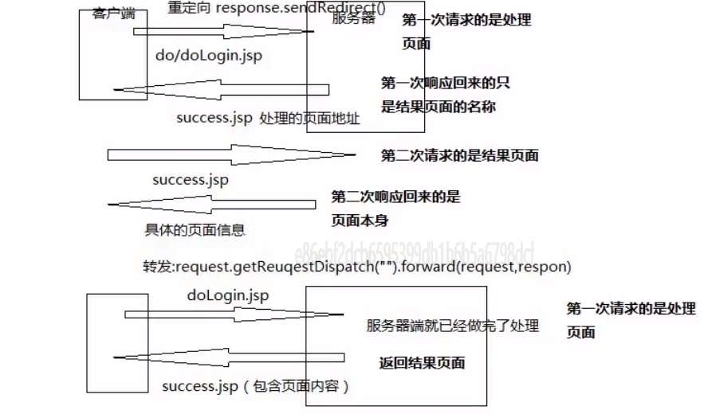

## 会话

> 从打开浏览器到关闭浏览器，期间访问服务器就称为一次会话

request存的值只能在单次请求中保存，保存的数据不能跨页面，当重定向时，request存的值会丢失

session的数据可以在多个页面中共享，即使重定向页面，数据不会丢失

session中可以包含若干request

### 常用方法

`void setAttribute(String key,Object value)`以key/value的形式保存对象值，将数据存储在服务器端

`Object getAttribute(String key)`通过key获取对象值

`void invalidate()`设置session对象失效

`String getId()`获取sessionid，当第一次登录成功后，session会产生一个唯一的id，浏览器之后访问时如果发现id值还是之前id，那么说明 当前访问的属于同一个对话

`void setMaxInactiveInterval(int interval)`设定session的非活动时间

`void getMaxInactiveInterval()`获取session的有效非活动时间（以秒为单位）默认30min

`void removeAttribute(String key)`从session中删除指定名称的对象

**让session失效的方式：**

1. invalidate()
2. removeAttribute("key")
3. 关闭浏览器

补充：

自动刷新到某页面：

```html
<meta http-equiv="refresh" content="3;url=index.jsp">
```

在head中添加该标签，单位：second


## 获取初始化参数

request.setCharacterEncoding("utf-8");代码耦合度太高，不便于后期维护，可以通过初始化参数实现

实现方式：

1. 在web.xml中先定义初始化参数

```xml
 <servlet>
        <servlet-name>a2</servlet-name>
        <servlet-class>
            com.bob.MyServlet2
        </servlet-class>
        <!--仅限于当前servlet中可获取，其它servlet不可获取-->
        <init-param>
            <param-name>mycode</param-name>
            <param-value>utf-8</param-value>
        </init-param>
    </servlet>

    <servlet-mapping>
        <servlet-name>a2</servlet-name>
        <url-pattern>/testservlet2</url-pattern>
    </servlet-mapping>

全局：
 <context-param>
        <param-name>mycode-all</param-name>
        <param-value>gbk</param-value>
    </context-param>
```

2. servlet中获取初始化参数，重写init()方法

```java
  System.out.println("初始化参数:"+servletConfig.getInitParameter("mycode-all"));//获取本servlet初始化参数

  System.out.println("context-init:"+servletConfig.getServletContext().getInitParameter("mycode-all"));//获取全局初始化参数
```


2. 全局初始化参数
   1. ​	定义，context-param是和servlet同级别标签
   2. 获得数据


## servlet 3.0

> 从Servlet3.0开始，配置Servlet支持注解方式，但还是保留了配置web.xml方式，所以使用Servlet有两种方式：
>
> 1. Servlet类上使用 `@WebServlet`注解进行配置
> 2. web.xml文件中配置

### 常用属性

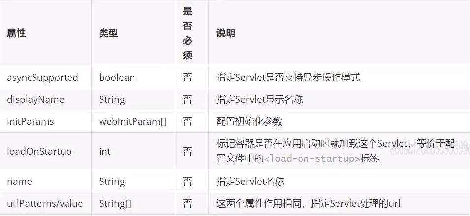

```java
@WebServlet(name="servlet3",urlPatterns = {"/testservlet3"},initParams = {
        @WebInitParam(name = "mya1",value = "myinit"),
        @WebInitParam(name = "mya2",value = "myinit-2")
},loadOnStartup = 1)
public class MyServlet3 extends HttpServlet {

    public MyServlet3() {
        System.out.println("myservlet3()");
    }
    @Override
    public void destroy() {
        super.destroy();
        System.out.println("Destroy()");
    }

    @Override
    public void init(ServletConfig config) throws ServletException {
        System.out.println("myservlet3-init-param="+config.getInitParameter("mya1"));
        System.out.println("myservlet3-init-param="+config.getInitParameter("mya2"));
    }

    @Override
    protected void doGet(HttpServletRequest req, HttpServletResponse resp) throws ServletException, IOException {
        super.doGet(req, resp);
        System.out.println("doget-myservlet3");
    }

    @Override
    protected void doPost(HttpServletRequest req, HttpServletResponse resp) throws ServletException, IOException {
        super.doPost(req, resp);

        System.out.println("dopost-myservlet3");

    }
}
```

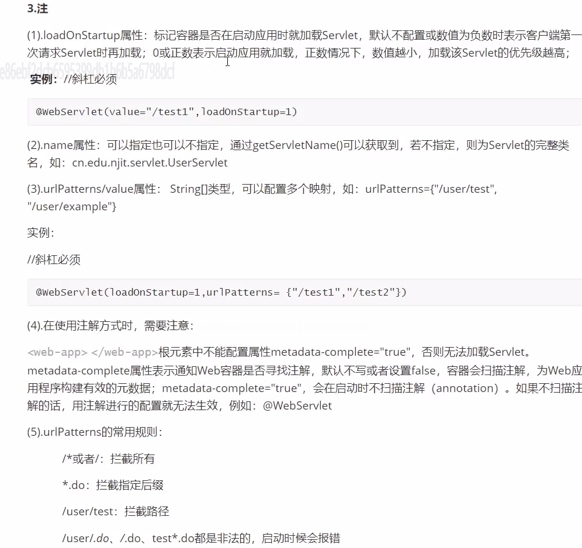

# JSP

## 什么是jsp

> Java Server Pages，中文名叫Java服务页面，其根本是一个 **简化的Servlet设计**，它是由Sun Microsystem公司倡导、许多公司参与一起建立的一种动态网页技术标准。是在传统的网页html文件中插入Java程序段和jsp标记，从而形成jsp文件，后缀名为（.jsp）。用jsp开发的web应用是跨平台的，既能在linux下运行，也可以在其它的操作系统下运行。

JSP将网页逻辑和网页设计的显示分离，支持可重用的基于组件的设计，使基于web的应用程序的开发变得迅速和容易。

.html	静态页面

.jsp		动态页面（页面数据可以动态更新，支持嵌套java代码和html代码）

## 为什么要有JSP

> Servlet展示信息不方便
>
> JSP本质上是一个Servlet
>
> JSP就是在html文件中嵌入了java代码

## 如何在JSP中嵌套Java代码

脚本 `<% java code%>`

### 声明标签

`<%! 变量或者方法声明%>`

```jsp
<%!  //javaCodes
      int a=10;
  String b = "abc"; %>

  <%!  public String test(){
    return b;
  }%>
```


### 表达式标签

`<%= 表达式%>`在页面上显示的效果

```jsp
 a=<%=a%><br>
  btest=<%=test()%>
```


### 程序代码标签

`<% java code%>` 页面上动态展示内容


```
//page指令

```


## JSP的原理

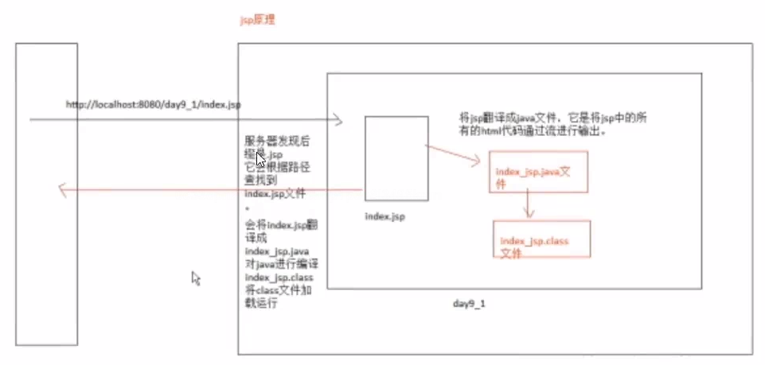

当浏览器访问URL时，服务器发现后缀名为.jsp，它会根据路径找到index.jsp文件，会将index.jsp翻译成index_jsp.java文件，会对这个java文件编译，产出一个index_java.class文件，将class文件加载运行。将JSP翻译成java文件，**它是将jsp中的所有html代码通过流的方式进行输出**，也就是说最终翻译成class，被虚拟机加载，它本质上是servlet，他就会往回响应，响应回去就是把jsp中的HTML代码以流的方式写回浏览器，所以在JSP中展示了html代码

## JSP内置对象

JSP一共预先定义了9个对象：**request	response    session    application    out    pagecontext    config    page    exception**

### request

​	request对象是javax.servlet.httpServletRequest类型的对象，该对象代表了客户端的请求信息，主要用于接受通过HTTP协议传送到服务器的数据。（包括头信息，系统信息，请求方式以及请求参数等）request对象的作用域为一次请求。

### response

​	response代表的是客户端的响应，主要是将JSP容器处理过的对象传回客户端。response对象也具有作用域，它只在JSP页面内有效，所属类型：HttpServletResponse

### session

​	是由服务器自动创建的与用户请求相关的对象，服务器为每个用户都生成一个session对象，用于保存该用户的信息，跟踪用户的操作状态，session对象内部使用	**Map**类来保存数据，因此保存数据的格式为“Key/Value”。session对象的value可以使复杂的对象类型，而不仅仅局限于字符串类型，HttpSession

### application

​	可将信息保存在服务器中，直到服务器关闭，否则application对象中保存的信息会在整个应用中都有效，与session对象相比，application对象生命周期更长，类似于系统的“全局变量”ServletContext

​	区别：

​		request：单次请求

​		session：浏览器访问期间（会话期间）

​		application：服务器启动期间，所存的数据可以跨浏览器


### out

​	用于在Web浏览器内输出信息，并且管理应用服务器上的输出缓冲区


### pageContext

在当前页面存储数据

### config

获取配置信息

### page

相当于this

### exception

## JSP的指令

> JSP指令用来设置整个JSP页面相关的属性，如网页的编码方式和脚本语言。

语法格式：

```
<%@ directive attribute="value"%>
directive:指令名称	attribute:属性名	value:属性值
```

| 指令名称    | 描述                                                    |
| ----------- | ------------------------------------------------------- |
| **page**    | **定义网页依赖属性，比如脚本语言、缓存需求、error界面** |
| **include** | **包含其它文件**                                        |
| **taglib**  | **引入标签库的定义**                                    |

### page指令

为容器提供当前页面的使用说明 **一个JSP页面可以包含多个page指令**

​	page指令语法：`<%@ page attribute="value"%>`

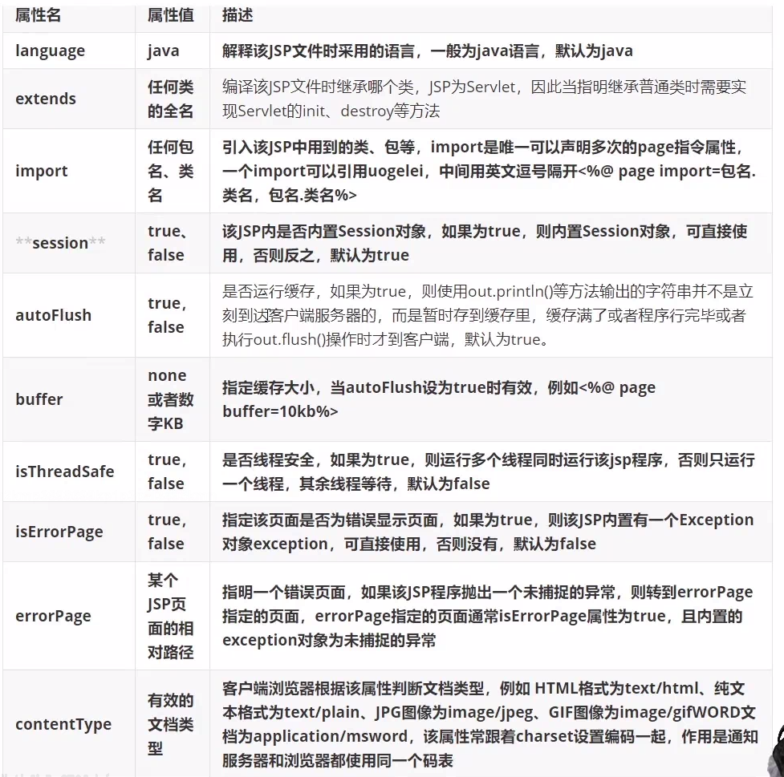

### **include 指令**

JSP可以通过include指令来包含其它文件。**被包含的文件可以是JSP、HTML或文本文件。**包含的文件本身就好像是该JSP文件的一部分，会被同时编译执行。

语法：`<%@ include file="文件相对 url 地址"%>`

include指令的文件名实际上是一个相对的url地址。

如果没给文件关联一个路径，JSP编译器默认在当前路径下寻找。

### **taglib指令**

JSP API允许用户自定义标签，一个自定义标签库就是自定义标签的集合。

taglib指令引入一个自定义标签集合的定义，包括库路径、自定义标签。

语法：`<%@ taglib url="url" perfix=""%>`

url确定标签库的位置，perfix属性指定标签库的前缀（自定义）

## JSP出现的状态码


## EL表达式

> Expression Language 表达式语言
>
> 最初定义于JSTL1.0部分
>
> 在JSP2.0中，EL从JSTL中剥离出来，放置在	JSP规范中，成为JSP2.0规范的一部分
>
> 在JSP中使用EL表达式，可以简化对象和变量的访问

### 语法

`${需要展示的信息的名字}`

注意：

**当表达式没有指定变量或者对象的范围时，容器会依次从：**

**pageContext-->request-->session-->application中查找该变量或者对象，我们可以通过隐含对象获得指定作用域的值：**

pageScope对象：用于获取**当前页面**的属性值

requestScope对象：用于获取**请求范围**的属性值

sessionScope对象：用于获取**会话范围**的属性值

applicationScope对象：用于获取**程序范围**的属性值

语法：

`${requestScope.key}`

### EL中的基础操作符

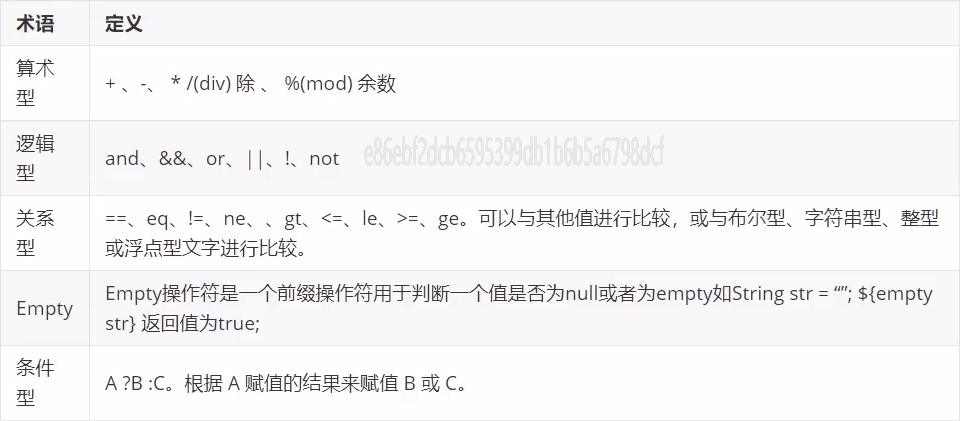

示例：

```
单个变量：${a+10}<br>
单个变量：${s}<br>
单个对象：${key.属性名}<br>
//对象类型
Users u = new Users();
u.setName("Bob");
u.setPass("abc");
pageContext.setAttribute("u1",u);
user.name=${u1.name}
user.pass=${u1.pass}
//list 集合对象
List list = new ArrayList();
list.add("Bob");
list.add("30");
list.add(u);
pageContext.setAttribute("list2",list);
list1=${list2[0]}<br/>
list1=${list2[1]}<br/>
list1=${list2[2].pass}<br/>

//map集合
k1=${map.k1}<br>
k2=${map.k2.username} --- ${map1.k2.password}

//判断变量中是否有值或是否存在:${empty key值}
List list2 = new ArrayList();
list2.add("aa");
request.setAttribute("list222",list2);

//判断list2中是否有数据 ${empty list222}

```

## JSTL

> JSP标准标签库，是一个JSP标签集合，它封装了JSP应用的通用核心功能
>
> JSTL支持通用的、结构化的任务，比如说迭代，条件判断，XML文档操作，国际化标签，SQL标签。除了这些，它还提供了一个框架来使用集成JSTL的自定义标签
>
> 根据JSTL标签所提供的功能，可以将其分为五个类别：**核心标签  格式化标签  sql标签  xml标签  jstl函数**

### 作用

简化jsp页面编写代码

### 语法格式

先下载包standard.jar和jstl.jar，拷贝到/WEB-INF/lib下。

在JSP页面中引入 `<%@taglib perfix="页面使用的名称"url="功能范围的路径"%>`


### 核心标签

引用核心标签库的语法如下：

`<%@taglib perfix="c" uri="http://java.sun.com/jsp/jstl/core" %>`

核心标签的分类

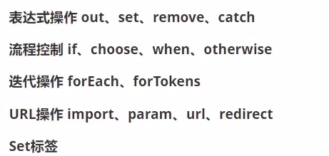


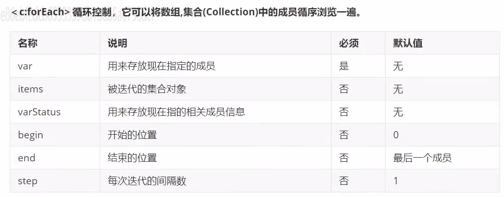

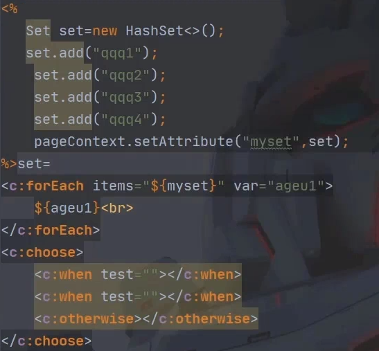

**格式化标签**

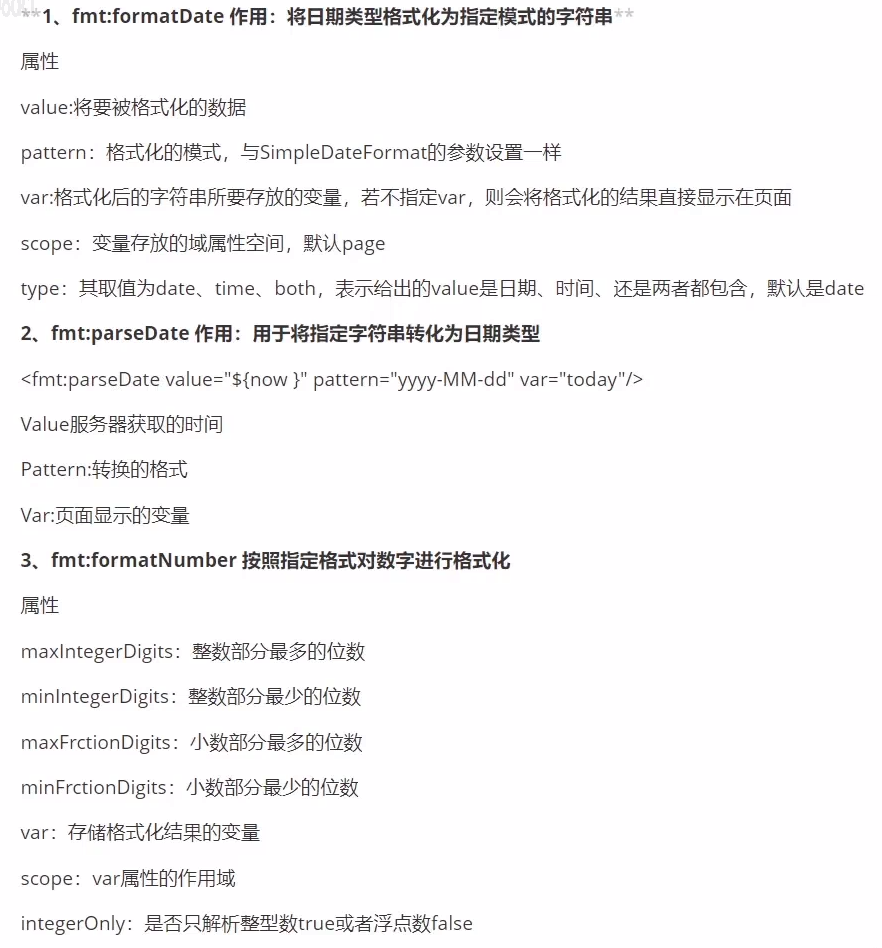

## Session和Cookie

### 什么是会话跟踪技术

> 是Web程序中常用的技术，用来跟踪用户的整个会话，保持对用户会话期间的数据管理。常用的会话跟踪技术是Session和Cookie

Cookie通过在客户端记录信息确定用户身份

Session通过在服务器端记录信息确定用户身份

### Cookie

> ​	cookie是客户端（一般指浏览器）请求服务器后，服务器发给客户端的一个辨认标识，保存在客户端，当客户端再次向服务器发送请求时，会携带着这个辨认标识，服务器就可以通过这个标识来识别客户端的身份或者状态等。
>
> ​	cookie的作用：跟踪会话，记录一次会话中（即session	，一次会话中可能会有多次请求，当然也可以有多个cookie来跟踪不同的信息）的信息，这样服务器就会知道用户的状态，比如有没有登陆成功，付款时购物车中的东西状态等，就相当于贴在客户端脑门上的纸条，浏览器看不到，但是服务器看得到。

#### Cookie的应用

##### 保持用户的登录状态


##### 记录用户名


#### Cookie的设置和获取

1. **通过HttpServletResponse.addCookie方式设置cookie**

```java
Cookie cookie = new Cookie("BOB","true");
response.addCookie(cookie);
```

2. **浏览器中查看cookie内容**

​			F12

3. **服务端获取客户端携带的cookie：通过HttpServletRequest获取**

```
<%
		Cookie[] cookies = request.getCookies();
			if(cookies!=null){
				for(Cookie c:cookies){
					String name = c.getName();//获取Cookie名称
					if("BOB".equals(name)){
						String value = c.getValue();//获取Cookie的值
						bool = Boolean.valueOf(value);//将值转化为Boolean类型
					}
				}
			}
%>
```

#### 删除Cookie

通过设置同名Cookie的最大存活时间为0，删除Cookie是指使浏览器不再保存Cookie，使Cookie立即失效	

example：

```java
Cookie cookie = new Cookie("username","BOB");

//设置最大存活时间为0
cookie.setMaxAge(0);

//将cookie发送给浏览器，来替换同名cookie
response.addCookie(cookie);
```

**Cookie的有效时间**

Cookie发送给浏览器之后，浏览器并不会永久保存，也就是到了一定的时间之后浏览器会自动销毁Cookie

Cookie的默认有效时间一般是一次会话（一次打开关闭浏览器），可以手动指定Cookie的有效时间

用`setMaxAge(int seconds)`来设置最大有效时间

### Session

> Session是另一种记录客户状态的机制，不同的是cookie保存在浏览器上，而s**ession保存在服务器上**。服务器把客户端信息以某种形式记录在服务器上，这就是session
>
> 如果说Cookie机制是通过检查客户身上的”通行证“来确定客户身份的话，那么Session机制就是通过检查服务器上的“客户明细表”来确认客户身份，Session相当于建立在服务器上的一份客户档案，客户来访的时候只需查档案。

#### 创建session的格式

#### session的生命周期 

#### session常用的方法

#### session的应用场景

登录	退出（创建和消除session）

#### session和cookie的区别

cookie保存在客户端，session保存在服务器

session 是由应用服务器维持的一个服务器端的存储空间，用户在连接服务器时，会由服务器生成一个唯一的 **SessionID**，用该sessionID作为标识符来存取服务器端的session存储空间。而**sessionID这一数据**则是保存到客户端，**用Cookie保存**的，用户提交页面时，会将这SessionID提交到服务器端，来存取session数据，这一过程，是不用开发人员干预的，所以用户**一旦禁用cookie，session也会失效**

Cookie是属于Session对象的一种，但有不同，Cookies不会占用服务器资源，是存在客户端内存或者一个cookie的文本文件中；而session则会占用服务器资源，所以尽量不用session，但是我们一般认为cookie是不可靠的，Cookie是保存在本机上的，但是其**信息的完全可见性**和**易于本地编辑性**，往往可以引起很多安全问题，session是可靠的，但是很多著名的站点也在用cookie

## 过滤器（Filter）

> 过滤器实际上就是对web资源进行拦截，做一些处理之后再交给下一个过滤器或servlet处理，通常都是用来拦截request进行处理的，也可以对返回的response进行拦截处理


### 语法格式

1. 创建一个类实现Filter接口

```java
public class CharSetFilter implements Filter{}
```

2. 重写接口中的方法

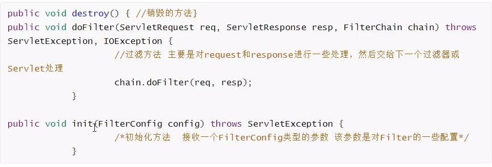

3. 在web.xml中配置


### 使用场景（常见的）

1. 防止用户未登录就执行后续操作
2. 设置编码方式-统一编码
3. 非法文字筛选
4. 下载资源的限制

特点：在servlet之前和之后都会执行

## 监听器（Listener）

> 监听器就是监听某个域对象的状态变化的组件

### 相关概念

​		事件源：被监听的三个对象（三个域对象：reques	session	pageContext）

​		监听器：监听事件源 对象事件源 对象的状态变化都会触发监听器

​		注册监听器：将监听器与事件源绑定

​		响应行为：监听器监听到事件源的状态变化时所涉及的功能代码（开发人员编写）

### 分类

​		第一维度按照被监听的对象划分：ServletRequest域、HttpSession域、ServletContext域

​		第二维度按照就监听的内容分：监听域对象的创建与销毁、监听域对象的属性变化

### 监听器三大域对象的创建与销毁

**监听器的编写步骤（重点）**

​		编写一个监听器类去实现接口

​		覆盖监听器的方法

​		需要在web.xml中进行配置---注册

```java
<listener>
        <listener-class>监听器类所在的路径</listener-class>
    </listener>
```

**ServletContextListener**

​		监听ServletContext域的创建于销毁的监听器

Servlet域的生命周期

​		何时创建：服务器启动创建

​		何时销毁：服务器关闭销毁

ServletContextListener监听器的主要作用

​		初始化工作：初始化对象、初始化数据（加载数据库驱动，连接池的初始化）

​		加载一些初始化的配置文件（spring的配置文件）

​		任务调度（定时器--Timer/TimerTask）

**HttpSessionListener**

​		监听HttpSession域的创建和销毁的监听器

HttpSession对象的生命周期

​		何时创建：第一次调用request.getSession时创建

​		何时销毁：服务器关闭销毁、session过期（默认30min）、手动销毁

HttpSessionListener的主要作用

​		由于每次访问网站都会创建默认session对象（jsp页面中page指令中的session属性值默认为true，即被访问时创建session），可以用于计数网站的访问人数

**ServletRequestListener**

​		创建：每一次请求都会创建request

​		销毁：请求结束

​		用法同上，用处不太大，省略

# MVC

> 写JavaWeb项目时会发现，一个中型或大型项目，随着代码量的增多，会发现：代码既可以写在src目录下，也可以写在WebContent目录下，src下可以建很多包，WebContent下可以建很多文件夹
>
> 所以出现了问题：一个新的类，到底往哪个目录下的哪个文件夹去写？
>
> 一个可能的解决方案：模式规范，MVC

## MVC设计模式

Web MVC中的M(模型)-V(视图)-C(控制器)概念和标准MVC概念一样，下图是Web MVC的标准架构

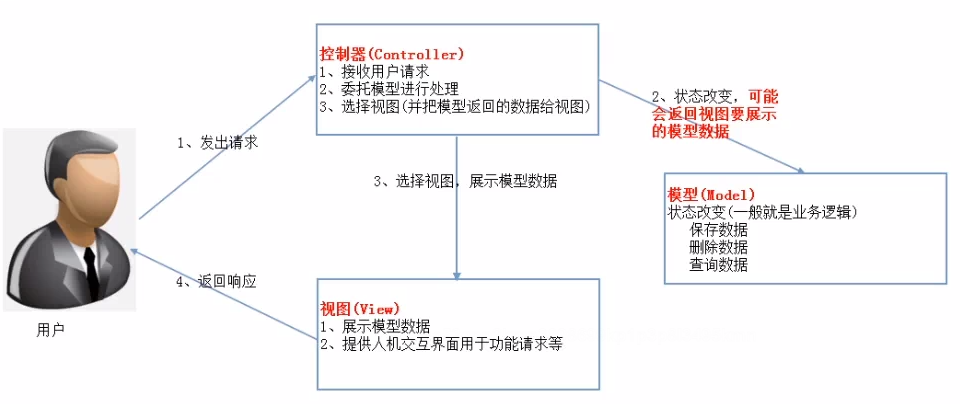

在Web MVC模式下，模型无法主动推数据给视图，如果用户想要视图更新，需要再发送一次请求（即请求-响应模型）


M：（Model）模型：应用程序的核心功能，管理这个模块中用的 **数据和值**(bean,dao)

```
JavaBeans：是Java中一种特殊的类（换言之，JavaBean就是一个Java类）
一个Java类，满足以下要求，则可称之为一个JavaBean
	1.public修饰的类，提供public无参构造方法
	2.所有属性都是private
	3.提供getter和setter方法
	
从使用层面来看，JavaBean分为两大类
	1.封装业务逻辑的JavaBean
	2.封装数据的JavaBean（实体类：eg：Student.java Vadio.java。往往对应于数据库中的一张表，即数据库中有个Student表，项目中就有个Student.java类）通常表名=类名，列名=属性名
	
Javabean是一个可以重复使用的组件，通过编写一个组件来实现某种通用功能：“一次编写，在任何地方执行，任何地方重用”
```

V：（View）视图：视图提供模型的展示，管理模型如何展示给用户，它是应用程序的外观（jsp/html）

C：（Controller）控制器：对用户的输入作出反应，管理用户和视图的交互，是连接模型和视图的枢纽（servlet/service）。

MVC用于将web（UI）层进行职责解耦

**mvc设计模式不属于23种设计模式**

## 三层架构

三层架构，通常意义上的三层架构就是将整个业务应用划分为：表现层（UI）、业务逻辑层（BLL）、数据访问层 （DAL）。区分层次的目的即为了“高内聚，低耦合”的思想

1、表现层（UI）：通俗讲就是给人看的东西，所见即所得（jsp/html）

2、业务逻辑层（BLL）：针对具体问题的操作，也可以说是对数据层的操作，对数据的业务逻辑进行处理。（servlet/service）

3、数据访问层（DAL）：该层所作事务直接操作数据库，针对数据的crud。dao表现层实现的代表作品是Struts、SpringMVC框架。

业务层实现的代表作品是Spring

持久层实现的代表作品是MyBatis、Hibernate

层就相当于一个黑盒，我们不用知道它的内部如何实现，只需要知道如何去调用它就行了。每层至于上下两层打交道。当一层内部由于技术变迁发生变化时，只要接口不变，其它层不用做出任何改变。分层之后灵活性提高，也便于团队开发。

## 三层架构和MVC的区别与联系


MVC是Module-View-Controller，严格来说这三个加起来以后才是三层架构中的UI层，也就是说，MVC把三层架构中的UI层再度进行了分化，分成了控制器、视图、实体三个部分，控制器完成页面逻辑，通过实体来与界面层完成通话，而C层	直接与三层中的BLL业务逻辑层进行对话。


MVC可以是三层中的一个表现层框架，属于表现层。三层可以与共存。

三层是基于业务逻辑来分的，而MVC是基于页面来分的。

MVC主要用于表现层，三层主要用于体系架构，三层一般是表现层、中间层、数据层，其中表现层又可以分为M,V,C

# AJAX

> AJAX = Asynchronous Javascript And XML（异步的Javascript和XML）
>
> AJAX不是新的编程语言，而是一种使用现有标准的新方法
>
> AJAX是与服务器交换数据并更新部分网页的艺术，在不重新加载整个页面的情况下

## 技术

Ajax由以下技术组合而成：

> 1.使用CSS和XHTML表示
>
> 2.使用DOM模型来交互和动态显示
>
> 3.使用XMLHttpRequest来和服务器进行异步通信
>
> 4.使用JavaScript来绑定和调用

Ajax的核心是 **XMLHttpRequest**对象

不同的浏览器创建XMLHttpRequest对象的方法是有差异的

**IE浏览器使用ActiveXObjct，而其它的浏览器使用名为XMLHttpRequest的JavaScript内置对象**

## 工作原理

相当于在用户和服务器之间加了一个中间层（Ajax引擎），使用户与服务器响应异步化。并不是所有的用户请求都提交给服务器。像一些数据验证和数据处理等都交给Ajax引擎自己操作，只有确定需要从服务器读取新数据时再由Ajax引擎代为向服务器提交请求

和传统模式的区别：


再看看它们各自的交互

浏览器的**普通**交互方式

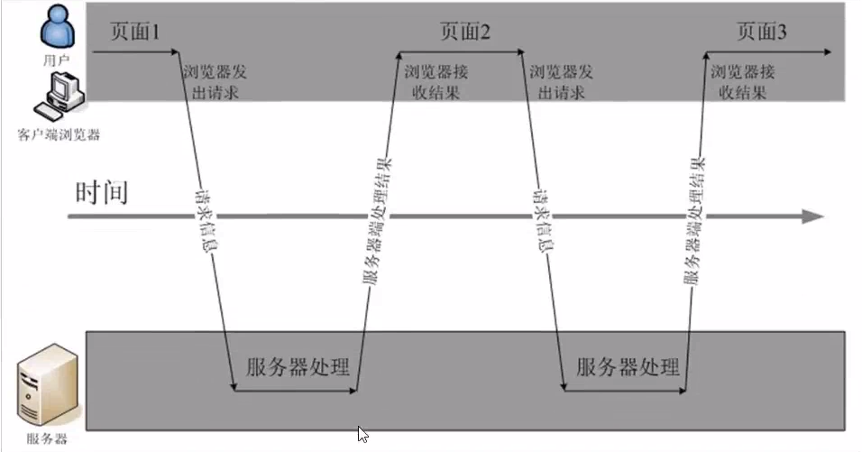

浏览器的**Ajax**交互方式

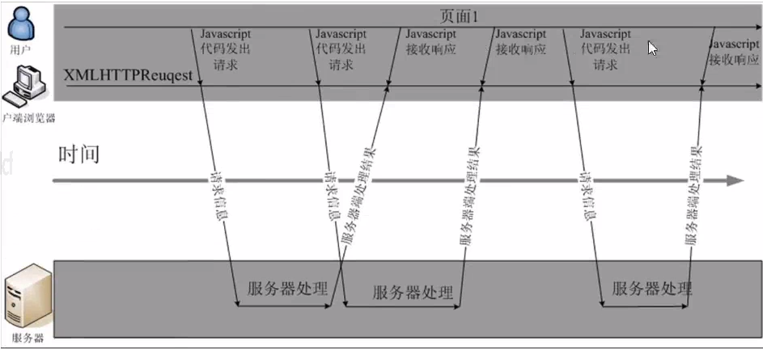

在创建web站点时，在客户端执行屏幕更新为用户提供了很大的灵活性。下面是Ajax可以完成的功能：

动态更新购物车的物品总数，无需用户单击update并等待服务器发送整个页面

提升站点的性能，这是通过减少从服务器下载的数据量而实现的。

消除了每次用户输入时的页面刷新。例如，在Ajax中，如果用户在分页列表上单击Next，则服务器数据只刷新列表而不是整个页面

直接编辑表格数据，而不是要求用户导航到新的页面来编辑数据，对于Ajax，当用户点击edit时，可以将静态表格刷新为内容可编辑的表格，用户单击Done后，就可以发一个Ajax请求来更新服务器，并刷新表格，使其包含静态、只读的数据。

### XMLHttpRequest常用属性

#### onreadystatechange属性		(on ready state change)

存有处理服务器响应的函数。

下面的代码定义一个空的函数，可同时对onreadystatechange属性进行设置

```java
xmlHttp.onreadystatechange=function(){//cods}
```

#### readyState属性

存有服务器响应的状态信息。当readyState改变时，onreadystatechange函数就会被执行，readyState属性可能的值


我们要向这个onreadystatechange函数添加一条if语句，来测试我们的响应是否已经完成（意味着得到了数据）:

```
xmlHttp.onreadystatechange = function(){
		if(xmlHttp.readyState==4){
			//从服务器的request获取数据	
		}
}
```

#### responseText属性

可以通过responseText属性来取回由服务器返回的数据

在我们的代码中，我们将把时间文本框的值设置为等于responseText

```javascript
xmlHttp.onreadystatechange = function(){
		if(xmlHttp.readyState == 4){
			document.myForm.time.value = xmlHttp.responseText;
		}
}
```

其它属性如下：


### XMLHttpRequest方法

#### open()方法

三个参数，第一个参数定义发送请求所使用的方法，第二个参数规定服务器端脚本的URL，第三个参数规定应当对请求进行异步地处理

```javascript
xmlHttp.open("GET","test.php",true)
```

#### send()方法

send()方法将请求送往服务器如果我们假设HTML文件和PHP文件位于相同的目录，那么代码如下：

```js
xmlHttp.send(null);
```

其它方法如下：


## AJAX编程步骤

> 为了方便理解，给Ajax统一了一个流程，要想实现Ajax，就按照以下步骤
>
> 1. 创建XMLHttpRequest对象
> 2. 设置请求方式
> 3. 调用回调函数
> 4. 发送请求

具体步骤：

### 创建XMLHttpRequest对象

语法：

```js
var xmlHttp = XMLHttpRequest();
```

若是IE浏览器，则使用ActiveX对象，语法：

```js
var xmlHttp = new ActiveXObject("Microsoft.XMLHTTP");
```

一般在手写Ajax时，首先要判断该浏览器是否接受XMLHttpRequest对象，如果支持则创建该对象，如果不支持则创建ActiveX对象：

```js
var xmlHttp;
if(window.XMLHttpRequest){
	//非IE
	xmlHttp = new XMLHttpRequest();
}else if{
	xmlHttp = new ActiveXObject("Microsoft.XMLHTTP");
}
```

### 设置请求方式

在Web开发中，请求有两种形式，一个是get,一个是post所以在这里需要设置一下具体使用哪个请求，XMLHttpRequest对象的open()方法就是用来设置请求方式的。

open()方法


```js
//第二步：设置和服务器端交互的相应参数，向路径url准备发送数据
var url = "your url";
xmlHttp.open("POST",url,ture);
```

open方法如下：


### 调用回调函数

如果在上一步中open方法的第三个参数是true那么当前就是异步请求，这时候需要写一个回调函数，XMLHttpRequest对象中有一个onreadystatechange属性，这个属性返回的是一个匿名的方法，所以回调函数就在这里写`xmlHttp.onreadystatechange = function{}`function内部的代码就是回调函数的内容，所谓回调函数，**就是请求在后台处理完，再返回到前台所实现的功能。**

```js
xmlHttp.onreadystatechange = function{
	if(xmlHttp.readyState == 4&& xmlHttp.status == 200){
		var obj = doucument.getElementById(id);
		obj.innerHTMl = xmlHttp.responseText
	}else{
		alert("AJAX ERROR")
	}
}
```

### 发送请求

```js
//设置发送请求的内容和发送报文。然后发送请求
var uname = doucument.getElementsByName("userName")[0].value;
var upass = doucument.getElementsByName("userPass")[0].value;
var params = "userName="+uname+"&userPass="+upass+"&time="+Math.random();
//增加time随即参数，防止读取缓存
xmlHttp.setRequestHeader("Content-type","application/x-www-form-urlencoded;charset=UTF-8");
//向请求添加Http头，POST如果有数据一定要加
xmlHttp.send(params);
```

如果需要像HTML表单那样POST数据，使用setRequestHeader()来添加HTTP头，然后在send()方法里规定希望发送的数据

## jQuery的Ajax操作

### 传统方式实现Ajax的不足

步骤繁琐

​	方法属性常用值很多，不易记忆

### ajax()方法

可以通过发送HTTP请求加载远程数据，是jQuery最底层的Ajax实现，具有较高灵活性

`$.ajax([settings])`参数settings是方法的参数列表，用于配置Ajax请求的键值对集合

```
$.ajax({
	url:请求地址
	type:"get| post | put | delete"默认是get,
	data:请求参数{id:"123" , pwd:"123456"},
	dataType:请求数据类型"html|text|json|xml|script|jsonp"},	
    success:function(data,dataTextStatus,jqxhr){ },
	error:function(jqxhr,textStatus,error)//请求失败时
	})
```

### get()方法通过远程HTTP GET请求载入信息

这是一个简单的GET请求功能以取代复杂$.ajax。

```
$.get (url,data,function(result)){
//省略将服务器返回的数据显示到页面的代码
};
```

url:请求的路径

data：发送的数据

success：成功函数

datatype：返回的数据

### post()方法通过远程HTTP GET请求载入信息

```
$.post(url,data,function(result)){
	//codes
}
```

url:请求的路径

data：发送的数据

success：成功函数

datatype：返回的数据

# JSON

>  JavaSciript Object Notation是一种轻量级的数据交换格式。易于阅读和编写。同时也易于机器解析和生成。json采用完全独立于语言的文本格式，但是也使用了类似于C语言家族的习惯，这些特性使json成为理想的数据交换语言

## JSON对象定义和基本使用

​	在标准的json格式中，json对象由花括号括起来，对象中的属性也就是json的key是一个字符串，所以一定要使用双引号引起来。每组key之间使用逗号进行分隔。

### JSON的定义

格式：

```json
var 变量名={
"key": value ,	//Number类型
"key2": "value" ,//字符串类型
"key3": [] ,	//数组类型
"key4": {} ,	//json对象类型
"key5": [{},{}] ,	//json数组
}
```

### JSON对象的访问

json对象，顾名思义就知道它是一个对象。里面的key就是对象的属性。我们要访问一个对象的属性，只需要使用【对象名.属性名】的方式访问即可（so easy）

```html
 <script type="text/javascript">
    var k1={
      "t1":1234,
      "t2":"Bob",
      "t3":{"uName":"Bob","age":20},
      "t4":[1,2,3,4]
    };
    alert(k1.t1);
    alert(k1.t2);
    alert(k1.t3.age);
    alert(k1.t4);
  </script>
```

### JSON在java中的使用

引入第三方包 `commons-beanutils.jar`

Java对象和json之间的转换

1. 单个对象或map集合

​		java->json:

```
User user = new User();
user.setName("Bob");
JSONObject obj = JSONObject.fromObject(user);//obj就是json格式的
```

​		json->java:

```
String str = "{'userName':'Bob','passWord':'666'}";
JSONObject json = JSONObject.fromObject(str);
User user = (User)JSONObject.toBean(json,User.class);
```

2. 对象集合和json的转换

​		java集合->json数组：

```java
//集合和json转换
        //1.list->json
        List list = new ArrayList();
        for (int i = 0; i < 5; i++) {
            Users kiki = new Users(i + 1, "KIKI" + i, "man");
            list.add(kiki);
        }
        JSONArray jsonArray = JSONArray.fromObject(list);
        System.out.println(jsonArray);
```

​		json数组->java集合

```java
//json ->list
        String str1= "[{\"sex\":\"man\",\"userId\":1,\"userName\":\"KIKI0\"},{\"sex\":\"man\",\"userId\":2,\"userName\":\"KIKI1\"},{\"sex\":\"man\",\"userId\":3,\"userName\":\"KIKI2\"},{\"sex\":\"man\",\"userId\":4,\"userName\":\"KIKI3\"},{\"sex\":\"man\",\"userId\":5,\"userName\":\"KIKI4\"}]";
        JSONArray jsonArray1 = JSONArray.fromObject(str1);
        Object[] array = (Object[]) JSONArray.toArray(jsonArray1, Users.class);
        for (Object o : array) {
            System.out.println(o);
        }
```

**总结：一般是三步走，1.得到对象或json字符串 2.fromObject或者fromArray得到JSONObject或者JSONArray 3.toBean（Array）方法得到真实对象或者集合（第三步只有json->java才有用）**

## JSON和AJAX应用实例

实现一个输入编号就能得到姓名和性别的需求

页面代码：

```jsp
<%--
  Created by IntelliJ IDEA.
  User: SuperBob
  Date: 2023/9/22
  Time: 15:08
  To change this template use File | Settings | File Templates.
--%>
<%@ page contentType="text/html;charset=UTF-8" language="java" %>
<html>
<head>
    <title>Title</title>
    <script type="text/javascript" src="js/jquery-1.8.0.min.js"></script>
    <script type="text/javascript">
        $(function (){
            $("#uId").blur(function (){
                var uId = $(this).val();
                //ajax
                $.post("/getUserById","uId="+uId,function (rs){
                    //将rs的数据进行转换,rs此时里面是json，属性对应着实体类的字段
                    //rs=eval("("+rs+")"); 这一行将返回的响应数据 rs 当作字符串进行解析，转换成JavaScript对象。
                    var user=JSON.parse(rs)//eval("("+rs+")");
                    $("#uName").val(user.userName);
                    $("#uSex").val(user.sex);
                });
            });
        })
    </script>
</head>
<body>
    userId:<input type="text" id="uId"><br>
    userName:<input type="text" id="uName"><br>
    userSex:<input type="text" id="uSex"><br>
</body>
</html>

```

Servlet代码：

```java
package com.bob.web;

import com.bob.bean.Users;
import net.sf.json.JSONObject;

import javax.servlet.ServletException;
import javax.servlet.annotation.WebServlet;
import javax.servlet.http.HttpServlet;
import javax.servlet.http.HttpServletRequest;
import javax.servlet.http.HttpServletResponse;
import java.io.IOException;
import java.io.PrintWriter;

@WebServlet(urlPatterns = {"/getUserById"})
public class GetUserByIdServlet extends HttpServlet {
    @Override
    protected void doGet(HttpServletRequest req, HttpServletResponse resp) throws ServletException, IOException {
        doPost(req, resp);
    }

    @Override
    protected void doPost(HttpServletRequest req, HttpServletResponse resp) throws ServletException, IOException {
        //接收参数
        String uId = req.getParameter("uId");
        //查询
        Users u= null;
        switch (uId){
            case "1":
                u=new Users(1,"Bob","男");
                break;
            case "2":
                u=new Users(2,"Bob2","男");
                break;
            case "3":
                u=new Users(3,"Bob3","男");
                break;
            case "4":
                u=new Users(4,"Bob4","男");
                break;
        }
        //返回数据给前端
        //将u这个对象包装成JSON对象
        JSONObject jsonObject = JSONObject.fromObject(u);
        resp.setContentType("text/html;charset=utf-8");
        //使用writer.println(jsonObject)将jsonObject写入响应流中。这样，响应的内容就会被发送回前端。
        PrintWriter writer = resp.getWriter();
        writer.println(jsonObject);
    }
}

```


## 使用smartupload.jar实现文件上传  

1.将jar包添加到项目中:smartupload.jar

 2.准备上传的页面

```
 <form action="toUpload" method="post"  enctype="multipart/form-data" >
	书名:<input type="text" name="bookName"/><br>
 	图片:<input type="file" name="自定义名称"/><br>
	<input type="submit" value="提交"/>
</form>
```

 注:(1)form标签中要添加enctype属性

​      (2)提交方式必须是post

3.开始获取数据,保存文件

实例代码：

```
public void upload(HttpServletRequest request, HttpServletResponse response)
	throws ServletException, IOException {
		try {
			//上传文件
			SmartUpload su=new SmartUpload();
			//获得pageContext对象
			JspFactory factory=JspFactory.getDefaultFactory();
			PageContext pagecontext=
				factory.
				getPageContext(this, request,response,
                                 null,false,1024,true);
			su.initialize(pagecontext);
			su.setCharset("utf-8");
			//实现文件数据的上传
			su.upload();
			
			File file = su.getFiles().getFile(0);
			//得到文件的基本信息
			String filename=file.getFileName();
			String type=file.getContentType();
			System.out.println("type="+type);
			String url="uploadfile/"+filename;
			//将上传文件保存到指定目录
			file.saveAs(url, SmartUpload.SAVE_VIRTUAL);
			request.setAttribute("filename",filename);
			
			String uname=su.getRequest().getParameter("uname");
			System.out.println("uname="+uname);
			request.getRequestDispatcher("success.jsp").forward(request, response);	
			
		} catch (SmartUploadException e) {
			// TODO Auto-generated catch block
			e.printStackTrace();
		}	
	}
```

注：(1)此时如果表单中有其他数据时，不能通过request直接获取，需要通过SmartUpload对象获取

​           String name=su.getRequest().getParameter("bookName");

​            并且该代码要在SmartUpload操作完成后添加

​     (2)解决乱码:

​          new String(name.getBytes("GBK"),"utf-8")

注:斜杠方向:/

注意:


| 参数          | 含义                                                         |
| ------------- | ------------------------------------------------------------ |
| servlet       | 请求的servlet，在servlet中传this即可                         |
| request       | servlet上挂起的当前请求                                      |
| response      | servlet上挂起的当前响应                                      |
| errorPageURL  | 请求JSP的错误页面的URL，或null                               |
| needsSSession | 是否需要session                                              |
| buffer        | 以字节为单位的缓冲区大小                                     |
| autoflush     | 缓冲区应该在缓冲区溢出时自动刷新到输出流，还是抛出IOException |

smartupload常用方法


**文件下载**

```
String name=request.getParameter("filename");
   String url="uploadfile/"+name;
    //将响应的内容设置为通用的二进制流
response.setContentType("application/octet-stream");
//attachment 告诉浏览器以附件的方式下载文件(弹出下载框)
name=URLEncoder.encode(name,"utf-8");
response.addHeader("Content-Disposition","attachment;filename="+name);

request.getRequestDispatcher(url).forward(request, response);
//清空缓冲区:将服务端缓冲区的文件内容,立即权并不传送给客户端
response.flushBuffer();
```

# Git

## 版本控制

如果在开发团队中没有使用版本控制，多个开发人员共同负责同一个软件或文档的开发，每个人在各自的机器上有整个软件文档的备份，并对之实施编程开发，在分别完成各自任务之后，再通过文本比对工具将各自机器上的不同版本的程序整合到一台机器上。没有进行版本控制或者版本控制本身缺乏正确的流程管理，在软件开发过程中将会引入很多问题，如软件代码的一致性、软件内容的冗余、软件过程的事务性、软件开发过程中的并发性、软件源代码的安全性，以及软件的整合等问题。

版本控制的目的是实现开发团队并行开发、提高开发效率的基础。其目的在于对软件开发进程中文件或目录的发展过程提供有效的追踪手段，保证在需要时可回到旧的版本，避免文件的丢失、修改的丢失和相互覆盖，通过对版本库的访问控制避免未经授权的访问和修改，达到有效保护企业软件资产和知识产权的目的。

版本控制的功能在于跟踪记录整个软件的开发过程，包括软件本身和相关文档，以便对不同阶段的软件及相关文档进行表示并进行差别分析，对软件代码进行可撤消的修改，便于汇总不同开发人员所做的修改，辅助协调和管理软件开发团队。


## 版本控制工具

### 2.1.Visual Source Safe(简称VSS）

VSS是美国微软公司的产品，目前常用的版本为6.0版。VSS是配置管理的一种很好的入门级的工具。

易学易用是VSS的强项，VSS采用标准的windows操作界面，只要对微软的产品熟悉，就能很快上手。VSS的安装和配置非常简单，对于该产品，不需要外部的培训（可以为公司省去一笔不菲的费用）。只要参考微软完备的随机文档，就可以很快的用到实际的工程当中。

VSS的配置管理的功能比较基本，提供文件的版本跟踪功能，对于build和基线的管理，VSS的打标签的功能可以提供支持。VSS提供share（共 享)、branch(分支）和合并（merge)的功能，对于团队的开发进行支持。VSS不提供对流程的管理功能，如对变更的流程进行控制。

VSS不能提供对异地团队开发的支持。此外VSS只能在windows平台上运行，不能运行在其他操作系统上。 有软件提供商提供VSS插件，可以同时解决VSS跨平台和远程连接两个问题，例如SourceAnywhere for VSS, SourceOffSite等。

VSS的安全性不高，对于VSS的用户，可以在文件夹上设置不可读，可读，可读/写,可完全控制四级权限。但由于VSS的文件夹是要完全共享给用户后，用户才能进入，所以用户对VSS的文件夹都可以删除。这一点也是VSS的一个比较大的缺点。

VSS没有采用对许可证进行收费的方式，只要安装了VSS，对用户的数目是没有限制的。因此使用VSS的费用是较低的。

微软不再对VSS提供技术支持。

### 2.2.Concurrent Version System(简称CVS）

CVS是开发源代码的配置管理工具，其源代码和安装文件都可以免费下载。

CVS是源于unix的版本控制工具，对于CVS的安装和使用最好对unix的系统有所了解能更容易学习，CVS的服务器管理需要进行各种命令行操作。目前，CVS的客户端有winCVS的图形化界面，服务器端也有CVSNT的版本，易用性正在提高。

CVS的功能除具备VSS的功能外，还具有：

它的客户机/服务器存取方法使得开发者可以从任何因特网的接入点存取最新的代码；它的无限制的版本管理检出(checkout)的模式避免了通常的 因为排它检出模式而引起的人工冲突；它的客户端工具可以在绝大多数的平台上使用。同样，CVS不提供对变更流程的自动管理功能。

一般来说，CVS的权限设置单一，通常只能通过CVSROOT/passwd, CVSROOT/readers, CVSROOT/writers文 件，同时还要设置CVS  REPOS的物理目录权限来完成权限设置，无法完成复杂的权限控制；但是CVS通过CVS ROOT目录下的脚本，提供了相应功  能扩充的接口，不但可以完成精细的权限控制，还能完成更加个性化的功能。

CVS是开发源码软件，无需支付购买费用。

同样因为CVS是开发源码软件，没有生产厂家为其提供技术的支持。如发现问题，通常只能靠自己查找网上的资料进行解决。

### 2.3.SVN

SVN全名Subversion，即版本控制系统。

SVN与CVS一样，是一个跨平台的软件，支持大多数常见的操作系统。作为一个开源的版本控制系统,Subversion 管理着随时间改变的数据。 这些数据放置在一个中央资料档案库中。 这个档案库很像一个普通的文件服务器, 不过它会记住每一次文件的变动。  这样你就可以把档案恢复到旧的版本, 或是浏览文件的变动历史。Subversion 是一个通用的系统, 可用来管理任何类型的文件,  其中包括了程序源码。

SubVersion：实现服务系统的软件。

TortoiseSVN：是SVN客户端程序，为windows外壳程序集成到windows资源管理器和文件管理系统的Subversion客户端。

SVNService.exe：是专为 SubVersion 开发的一个用来作为 Win32 服务挂接的入口程序。

AnkhSVN：是一个专为Visual Studio提供SVN的插件。

### 2.4.Git

Git是一个开源的分布式版本控制系统，用以有效、高速的处理从很小到非常大的项目版本管理.

Git 是 Linus Torvalds 为了帮助管理 Linux 内核开发而开发的一个开放源码的版本控制软件。

Torvalds 开始着手开发 Git 是为了作为一种过渡方案来替代 BitKeeper，后者之前一直是 Linux 内核开发人员在全球使用的主要源代码工具。开放源码社区中的有些人觉得 BitKeeper  的许可证并不适合开放源码社区的工作，因此 Torvalds 决定着手研究许可证更为灵活的版本控制系统。尽管最初 Git 的开发是为了辅助  Linux 内核开发的过程，但是我们已经发现在很多其他自由软件项目中也使用了 Git。例如 最近就迁移到 Git 上来了，很多  Freedesktop 的项目也迁移到了 Git 上。


## Git的使用

### **Git 与 SVN 区别**

- 1、Git 是分布式的，SVN 不是：

  这是 Git 和其它非分布式的版本控制系统，例如 SVN，CVS 等，最核心的区别。

- 2、Git 把内容按元数据方式存储，而 SVN 是按文件：

  所有的资源控制系统都是把文件的元信息隐藏在一个类似 .svn、.git 等的文件夹里。

- 3、Git 分支和 SVN 的分支不同：

  分支在 SVN 中一点都不特别，其实它就是版本库中的另外一个目录。Git 分支是指针指向某次提交，而 SVN 分支是拷贝的目录。这个特性使 Git 的分支切换非常迅速，且创建成本非常低。

  Git 有本地分支，SVN 无本地分支。在实际开发过程中，经常会遇到有些代码没写完，但是需紧急处理其他问题，若我们使用 Git，便可以创建本地分支存储没写完的代码，待问题处理完后，再回到本地分支继续完成代码。

- 4、Git 没有一个全局的版本号，而 SVN 有：

  ​    目前为止这是跟 SVN 相比 Git 缺少的最大的一个特征。

- 5、Git 的内容完整性要优于 SVN：

  Git 的内容存储使用的是 SHA-1 哈希算法。这能确保代码内容的完整性，确保在遇到磁盘故障和网络问题时降低对版本库的破坏。


### 3.1安装

下载地址:https://www.git-scm.com/download/win


 


 

检验是否安装成功,桌面上鼠标右击后:


 

### 3.2 git的工作区域

(1)工作区:用来对代码进行修改

(2)暂存区

(3)git仓库区

 

工作区->暂存区  git add 文件名

暂存区->仓库  git status 先查看文件状态

​     git commit -m  “提交描述”

 

### 3.3 初始化仓库

(1)新建文件夹，进入到该目录,右键打开git bash

(2)在文件夹内初始化git(创建git仓库)

  命令:git init  (会生成一个.git的隐藏文件)

(3)仓库中添加信息

​    git add 文件名-> 结果:new file：文件名  //工作区到暂存区

​    git add *  添加所有文件

   git commit -m ‘描述信息’        //暂存区到仓库

(4)仓库中修改信息

   修改完成后按照原来的程序再执行

 (5)删除文件

   git rm 文件名   如果想要删除文件夹，则添加参数 -r

   git commit  -m ‘提交描述’

 (6)删除文件夹

当我们需要删除暂存区或分支上的文件, 但本地又需要使用, 只是不希望这个文件被版本控制, 可以使用

 git rm -r --cached 文件夹名称

 实例: git rm  -r   --cached target  删除target文件夹

​          git commit -m '删除了target'  提交,添加操作说明

## Git远程服务器介绍

### 4.1 GitHub介绍

通过git管理github托管项目代码

gitHub是一个面向开源及私有软件项目的托管平台，因为只支持git 作为唯一的版本库格式进行托管，故名gitHub。

gitHub于2008年4月10日正式上线，除了git代码仓库托管及基本的 Web管理界面以外，还提供了订阅、讨论组、文本渲染、在线文件编辑器、协作图谱(报表)、代码片段分享(Gist)等功能。目前，其注册用户已经超过350万，托管版本数量也是非常之多，其中不乏知名开源项目 Ruby，on Rails、jQuery、python等。

访问地址:https://github.com/


### 4.2.GitLab

 GitHub 和 GitLab 都是基于 web 的 Git 仓库，使用起来二者差不多，它们都提供了分享开源项目的平台，

为开发团队提供了存储、分享、发布和合作开发项目的中心化云存储的场所。

GitHub 作为开源代码库，拥有超过 900 万的开发者用户，目前仍然是最火的开源项目托管平台，GitHub 同时提供公共仓库和私有仓库，但如果使用私有仓库，是需要付费的。

 GitLab 解决了这个问题，你可以在上面创建私人的免费仓库。

 GitLab 让开发团队对他们的代码仓库拥有更多的控制，相比较 GitHub , 它有不少特色：

(1) 允许免费设置仓库权限；

(2) 允许用户选择分享一个 project 的部分代码；

(3) 允许用户设置 project 的获取权限，进一步提升安全性；

(4) 可以设置获取到团队整体的改进进度；

(5) 通过 innersourcing 让不在权限范围内的人访问不到该资源；

所以，从代码的私有性上来看，GitLab 是一个更好的选择。但是对于开源项目而言，GitHub 依然是代码托管的首选。

访问地址:https://git.lug.ustc.edu.cn/users/sign_in

logo:

### 4.3 gitee(码云)

码云（Gitee）是 OSCHINA 推出的代码托管协作开发平台，支持 Git 和 SVN,提供免费的私有仓库托管。2016 年推出企业版，提供企业级代码托管服务，成为开发领域领先的 SaaS 服务提供商。

使用 GitHub 时，国内的用户经常遇到的问题是访问速度太慢，有时候还会出现无法连接的情况。如果你希望体验 Git 飞一般的速度，可以使用国内的代码托管与开发协作平台 —— Gitee。除了访问速度更快以外，Gitee 还提供了免费的私有仓库供个人开发者使用。同时，Gitee 也有着国内数一数二的开源生态，这里有非常多的优秀开源项目和开发者，你可以在这里和他们无障碍地沟通交流，不管是找开源项目还是分享自己的开源项目，Gitee 都是极佳的选择。

作为国内代码托管平台的佼佼者，目前已经有超过 500 万名开发者在 Gitee 上托管了 1000 余万个代码仓库，而其提供了研发管理、代码托管、文档管理服务的企业版的服务客户也超过了 10 万家。

访问地址:https://gitee.com/


### 4.4 注册账号

 地址:https://gitee.com/


###  **4.5.** **基本概念**

(1) 仓库（Repository）

  仓库即你的项目，你想在github上开源一个项目，那就必须要新建一个repository,如果你开源的项目多，那你拥有的仓库也就很多

(2) 收藏(star)

 仓库主页的star按钮，意思是收藏项目的人数。

(3) 复制克隆项目(fork)

 在原项目的基础上新增代码和结构，也可以理解成拿别人的代码进行二次加工。Fork后，会在自己账号下，生成自己的相同仓库

(4) 发起请求(pull request，简称PR)

  这个是基于fork的，当其他人改进完代码后，想将这个项目合并到原项目，则这个时候会给你发起一个pull request。如果接受了请求，这个时候就可以拥有改进的项目了

(5) 关注(watch)

 即观察，可以随时看到被关注项目的更新

(6) 事务卡片（Issue）

 发现代码有bug,但是目前还没成型，需要讨论时使用

 当别人发现你的问题时，会提个lssue

(7) Gitee主页

 账号创建完后，点击导航栏gitee图标即可进入主页。左侧显示功能列表，右侧显示仓库动态

(8) 仓库主页

 仓库主页主要显示项目的信息，如:代码，版本，收藏，关注，fork等

### **4.6.创建仓库**

 **一个git库对应一个开源项目**


**仓库主页说明**


### **4.7 仓库管理**

 **新建文件**

 **编辑/删除文件**

**被删除的文件如何查看信息**:

**上传文件**(可以同时选择多文件)：

**下载项目**:

**Gitee issue(问题)**

张三发现李四的开源git,提交issue,李四登录gitee后，和张三交流并关闭issue


### **4.8 基本概念实战**

收藏，关注，复制克隆项目,发起请求，事务卡片

删除仓库:


 

### 4.9 初始化git的基本信息

设置登录的账户信息: 用户名和邮箱地址是本地git客户端的一个变量，每次commit都会用用户名和邮箱纪录。

设置用户名: git  config  --global  user.name  ‘用户名’

 设置用户名邮箱: git config  --global user.email ‘邮箱’

   实例: git config  --global  user.email [‘123@qq.com’](mailto:‘123@qq.com’)

 命令执行位置:桌面右击->git  base here

 **注意:该设置在gitee仓库主页显示谁提交的文件,如果想要修改用户信息，则将该命令再执行一次**

 查看设置: git  config  --list

### 4.10 git管理远程仓库

目的:备份，实现代码共享

实现过程:

客户端:

(1)将本地项目提交到git

(2)建立本地和远程仓库的关系

步骤1:

  git克隆操作：将远程仓库的项目复制到本地

  命令:  git  clone  仓库地址

 仓库地址:


注意:初始化操作使用一次即可


步骤2:

git push 将本地仓库提交到远程（注意先提交到缓存区，再提交到仓库，最后提交远程）


步骤3：要更新你的本地仓库至最新改动，执行：

git pull

从非默认位置更新到指定的url。

git pull http://git.example.com/project.git

**实例:**

Cd 进入仓库


### **4.11 idea+git**

**Idea关联git**

**Idea自身路径需要在英文目录**

**1)Idea配置Git客户端:**

File — Settings---Version Control — Git关联Git安装目录下的

**bin/git.exe执行文件(这个就是git的客户端指令，类似svn.exe)**


2)下载gitee插件


 3)添加信息

注意:登录时，使用邮箱登录


4)本地项目上传到服务器


5)服务器项目下载到本地


